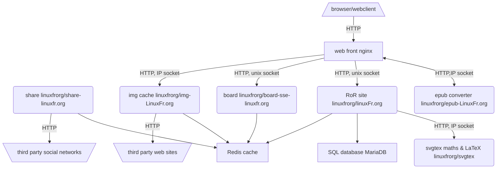

LinuxFr.org
===========

LinuxFr.org is a French-speaking website about Free software / hardware /
culture / stuff.

This git repository is the rails application that runs on LinuxFr.org.

Install
-------

See [INSTALL.md](INSTALL.md) to set up LinuxFr.org on a Debian environment.

Alternatively, you can read [Container.md](Container.md) to setup easily
LinuxFr.org development environment with a container engine like Docker or
Podman and use the [container composer](https://docs.docker.com/compose/).

See also
--------

Overview of LinuxFr.org stack:

* [The board daemon](https://github.com/linuxfrorg/board-sse-linuxfr.org)
* [The share daemon](https://github.com/linuxfrorg/share-LinuxFr.org)
* [The epub daemon](https://github.com/linuxfrorg/epub-LinuxFr.org)
* [The img daemon](https://github.com/linuxfrorg/img-LinuxFr.org)
* [SVGTeX](https://github.com/linuxfrorg/svgtex)

Copyheart
---------

The code is licensed as GNU AGPLv3. See the LICENSE file for the full license.

The [default avatar](https://linuxfr.org/images/default-avatar.svg) is a
[Tux](https://en.wikipedia.org/wiki/Tux) derived from
the [Tux Flat SVG](https://commons.wikimedia.org/wiki/File:TuxFlat.svg)
created by [gg3po](https://www.pling.com/u/gg3po/)
and [Iwan Gabovitch](http://qubodup.deviantart.com/)
under the GPL v2 or any later version.

[Feather icons](https://feathericons.com/) are licenced
[MIT](https://github.com/feathericons/feather/blob/master/LICENSE).

♡2011 by Bruno Michel. Copying is an act of love. Please copy and share.
